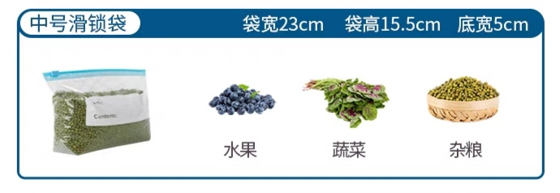

# CandyWiki

喜糖说明

喜礼

我们来自四川、重庆，为大家准备了一份具有家乡特色的一些零食风的喜礼：泡菜、婚礼喜糖、大凉山苦荞茶、灯影牛肉、磁器口麻花、合川桃片哈。小小的礼盒里面装满了酸、甜、苦、辣、麻。。。欢迎补充

    
    人生苦短
    

    
    幸有
    

    
    咸辣甜酸
    

    
    长伴
    

    
    —— —— - —— ——
    

---

    
    喜糖盒回收
    

如果您愿意，请不要将喜糖盒扔掉，可以选择将空的喜糖盒归还给我们，我们将为您兑换一个拉链式保鲜袋。

    
    *活动最终解释权归作者所有
    

